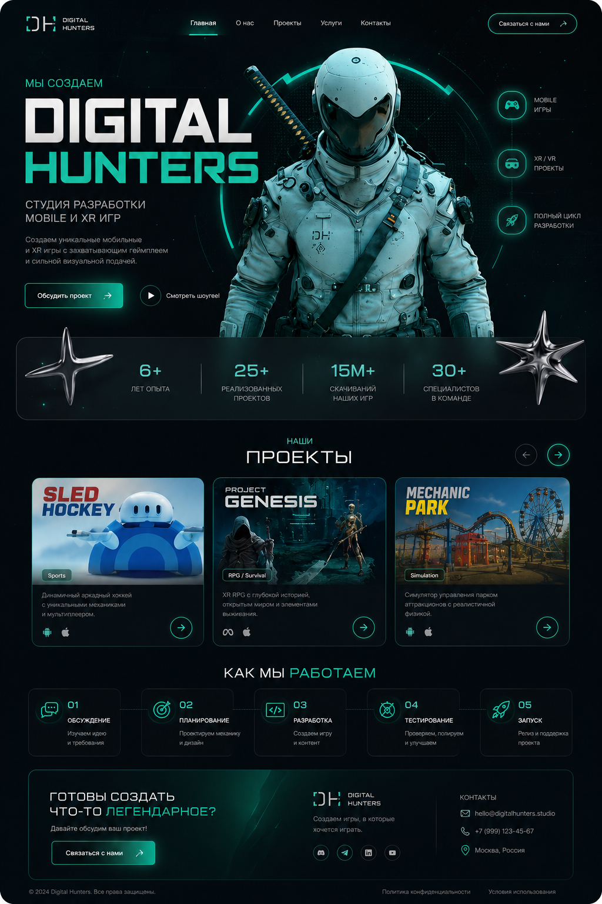

# A2 - Assignment Three

This folder contains the **Hard** version of **Assignment THREE**.

## Live Demo

[View Live Website](https://digital-hunters-weld.vercel.app/)

## Assignment Brief
You have to choose any three designs from the given designs and recreate them using **CSS Flexbox** and **Position** properties.

## Requirements
Use:
- `display: flex`
- `position: relative`
- `position: absolute`
- proper spacing and alignment techniques

## Goal
Try to make the design as close as possible to the original.

I made this replica:

## Assets
For images and assets, you can use:
- Google Lens
- Google Search
- Freepik
- Pinterest
- Unsplash
- PNG websites
- ChatGPT research

## Before Connecting With Mentors
Follow this process first:
1. Try solving the issue yourself
2. Discuss with your friends or group members
3. Research properly on GPT or Google
4. If you still can’t find the solution, connect with mentors

## What This Assignment Improves
- Research skills
- Problem-solving ability
- UI understanding
- CSS Flexbox concepts
- CSS Position concepts
- Real-world frontend structuring

## Folder Content
- `index.html` - page structure
- `styles.css` - styling for the Easy design
- `logo1.png` - local asset used in the layout

## Preview
Open `index.html` in a browser to view the design.
